# Vetsuvetsu(別別)
> Make your own wordbook(자신만의 단어장을 만드세요, 自分の単語帳を作りましょう)

Project homepage　:　https://vetsuvetsu.now.sh/

関心がある主題あるいわ勉強している本の単語を集まって便利に勉強してください

## プロジェクトを始めた理由

日本で働くために８月から塾で日本語の勉強を始めました。

外国語が上手になるためには何よりも基礎的な単語の量を増やすことが重要だと思います。

そのために塾で教えてくれた単語を熱心に勉強すると努力しました。

でも、塾で習った単語を熱心に書き取ってみたら授業が終わった後で見にくい場合が多かったです。

例えば、下の写真のような場合が多かったです。


そうして、勉強した単語を便利に見るためには毎度他のノートに単語を書き直す作業を繰り返しなければならなかったです。

例えば、下の写真のように単語を漢字と読み方と韓国語の意味の順に並べ替えながら纏めました。


しかし、こんなに纏めた単語ノートがますます増えるのはほかの問題を発生させました。

纏めた単語ノートの量が増えすぎて本の厚さ以上になって携帯性が急減になりました。


そして、携帯性がいい方法で勉強もできるし、同時に試験まで作ってくれるプロジェクトをして見るとどうかなと考えるようになりました。

## 重要な機能１

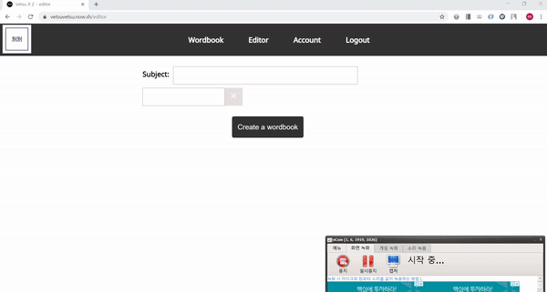

マウスを使わなくてもEditorに単語を便利に入力することができます。

韓国語や英語と違ってTabキー、スペース・バー、エンターキーが単語の入力に使われている日本語の特性によってキャップス・ロック・キーをトリガーで使いました。

この機能は以前によくつかったVimというEditorで霊感を受けました。

プログラマーではない一般的な使用者たちもマウスがなく使えるEditorがあったらいいじゃないかという意図でこんな方式で作るようになりました。

## 重要な機能２

### Desktop

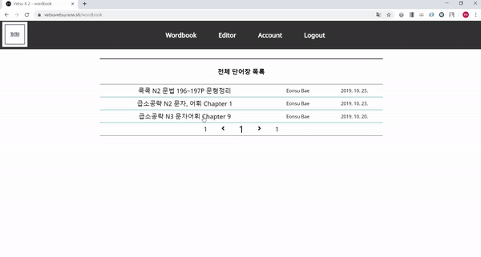

### Mobile


トグルボタンを押して漢字と読み方と意味を見えるようにあるいわ見えないように作ることができます。

この機能はノートに書いて纏めて勉強していた時、ほかの紙や本で漢字以外のものを見えないように勉強したのが能率が良かったおかげで作くるようになりました。

## 重要な機能３

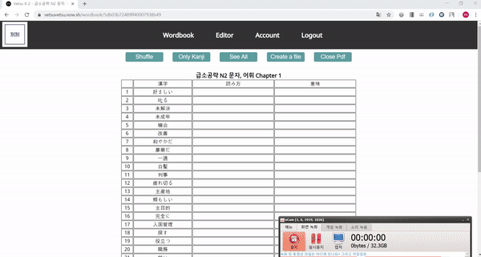

入力になった単語帳の中でランダムでテストを作ってPDFファイルでダウンロードをもらうことができます。

毎朝、塾でテストを受けていることのような形式で問題を自動的に作るようにしたかったので作りました。

## Skill Set（スキルセット）

プロジェクトに使われているスキルセットのリスト
* Typescript(Javascript superset)
* MERN Stack(MongoDB, Express, React, Node.js)
* Sass(CSS Preprocessor)
* Deployment : ZEIT NOW, MongoDB Atlas

### Typescript
  


Typescriptは動的タイプのランゲージのJavascriptを静的タイプのランゲージのように使うことができてくれます。

Typescriptの長所
* IDEの支援をよくもらうことができること
  - Javascriptの場合はIDEからもらうことができるオートコンプリートのような支援が制限的です。
  - 勿論Javascriptもアレイを作って下のラインでアレイのメソッドを作る程の支援はもらうことができます。
    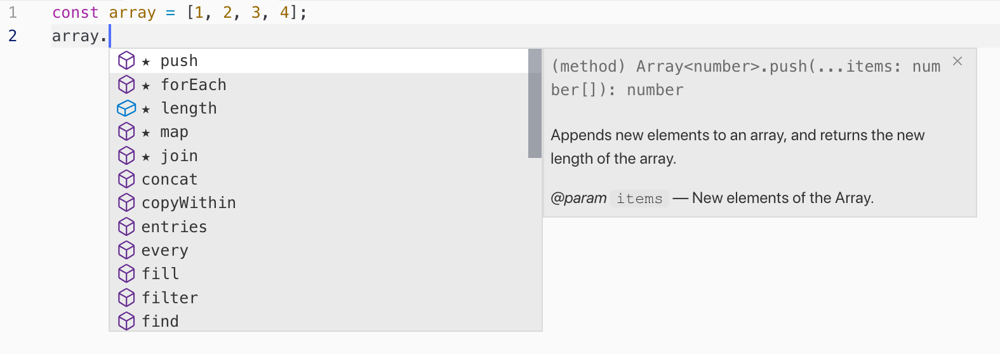
  - しかし次のようにほかの関数であるオブジェクトのメソッドを使う時オートコンプリートできない場合が多いです。
    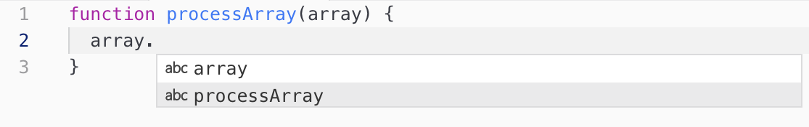
  - Typescriptを使ったら上のような場合にもIDEからオートコンプリートの支援をもらうことができます。
* だらしないミスを減らすことができること
  - 例えば、文字列タイプの変数をargumentでもらわなければならない関数にナンバータイプの変数をパラメーターで入れると言ったら
  - Javascriptの場合、IDEで問題で認めることができないので、後で関数が実行された後で問題を発見するようになります。
  - この以外にもほかのタイプの変数との比較やnullタイのプチェックの漏れなどはTypescriptを使ったら易しく問題を発見ができます。
* 他の人のcodeを読みやすくなること
  - Javascriptを使う時よりTypeがありますのでcodeの目的を理解することが便利になります。
```ts
// EditorRow.tsx
type Element = {
  type: string;
  value: any;
};

type EditRowProps = {
  onComplete: () => void;
  row?: any;
}

const EditorRow = ({ onComplete, row }: EditRowProps) => {
  const [inputText, setInputText] = useState("");
  const [elements, setElements] = useState<Element[]>([]);
  const [isComplete, setIsComplete] = useState(false);
  const rowContainerRef = useRef<HTMLDivElement>(null);
  // (...)
  const handleKeyUp = (event: React.KeyboardEvent<HTMLInputElement>) => {
    event.preventDefault();
    const keyCode = event.keyCode;
    // (...)
  };
  // (...)
  const handleTextInput = (event: React.ChangeEvent<HTMLInputElement>) => {
    const val = event.target.value;
    if (val === " ") return;
    setInputText(val);
  };

  const handleRowRemove = (event: React.MouseEvent<HTMLButtonElement>) => {
    const row: HTMLElement | null = event.currentTarget.parentElement;
    const rowCount: number = row.parentElement.childNodes.length;

    if (rowCount === 1) return;
    row.remove();
  };

  // (...)
}
```
* typeやinterfaceの内容を読む時variableの名前とtypeを通じてComponentやFunctionの動作を以前より予測ことが出来るうになります。

---

### MERN Stack

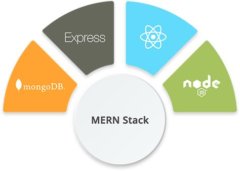

MERN Stackは現代発展のスピードが非常に速いJavascriptの生態系で普遍的に使われているスキルセットです。

Javascriptというランゲージだけでクライアントとサーバーの全てを開発できることが長所です。

---


* MongoDB
  - Mongoという名前の語源はhumongous(huge + monstrous)で'素晴らしい'ぐらいの意味を持っています。
  - データベースの名前がこの単語から始められた理由はMongoDBが多くのデータを囲うことができるからです。
  - 最近のWebの環境は昔に比べ、はるかに多くのデータを囲いする必要があります。
  - それに囲いする必要なデータは定型化がならないことも多くなります。
  - MongoDBはMySQLやOracleのようなSQLと違うschemelessです。ですから、データを以前より悠然に取ることができます。
  - 勿論schemelessからといって、SQLのような固定したデータの形を与えることやrelationを使うことができないわけではないです。

* MongoDBのCollection Schema（SQLのTABLEと似合うこと）
```js
// User.ts
const UserSchema = new mongoose.Schema({
  name: {
    type: String,
    required: true
  },
  email: {
    type: String,
    required: true,
    unique: true
  },
  password: {
    type: String,
    required: true,
    select: false
  },
  role: {
    type: String,
    required: true,
    default: 'student',
    enum: ['student', 'admin', 'teacher']
  },
},{
  timestamps: true
});

// Wordbook.ts
const WordbookSchema = new mongoose.Schema({
  subject: {
    type: String,
    required: true
  },
  words: {
    type: [],
    required: true
  },
  user: {
    type: ObjectId,
    ref: 'User',
    required: true
  },
},{
  timestamps: true
});
```
* 上のcodeはmongooseというMongoDBのODM library(SQLのORMのように)でschemaを定義したことです。
  - もしSQLでTABLEを定義した経験があったら難しくなく理解ができるはずです。
  - typeやrequiredやuniqueなどSQLでよく使うpropertiesを同一に使っているからです。
  - Wordbookのschemaのuserでrefを指定してrelationを設定することも似ています。
  - MongoDBではSQLでJOINを使ってrelationがあるデータを持ってくるようにpopulateという機能を使ってrelationがあるデータを持ってくることができます。

* MongoDBのpopulate例のcode
```js
// api/wordbook/index.ts
import mongoose from 'mongoose';

import Wordbook from '../../../models/Wordbook';
import connectDb from '../../../utils/connectDb';

const { ObjectId } = mongoose.Types;

export default async (req, res) => {
  connectDb();
  switch (req.method) {
    case "GET":
      handleGetRequest(req, res);
      break;
    case "POST":
      handlePostRequest(req, res);
      break;
    case "PUT":
      handlePutRequest(req, res);
      break;
    default:
      res.status(405).send(`Method ${req.method} not allowed`);
      break;
  }
};

const handleGetRequest = async (req, res) => {
  try {
    const { page, size } = req.query;
    const pageNum = Number(page);
    const pageSize = Number(size);
    let wordbooks = [];
    const totalWordbookCount = await Wordbook.countDocuments();
    const totalPage = Math.ceil(totalWordbookCount / pageSize);
  
    require('../../../models/User');
    if (pageNum === 1) {
      wordbooks = await Wordbook
                          .find()
                          .populate({ // populateを使ってWordbookを作成したUserを持ってきます。
                            path: 'user',
                            model: 'User'
                          })
                          .limit(pageSize)
                          .sort({ createdAt: 'desc' });
    } else {
      const skips = pageSize * (pageNum - 1);
      wordbooks = await Wordbook
                          .find()
                          .populate({　// populateを使ってWordbookを作成したUserを持ってきます。
                            path: 'user',
                            model: 'User'
                          })
                          .skip(skips)
                          .limit(pageSize)
                          .sort({ createdAt: 'desc' });
    }
    res.status(200).send({ wordbooks, totalPage });
  } catch (error) {
    console.log(error);
  }
};
// (...)
```
* GET /wordbook endpointにapiを呼び出す時エクセキュートされるhandleGetRequest関数のcodeです。
  - populate methodで userの情報を持ってきていることを見ることができます。
  - まずWordbook schemaのなかでrelationを設定したpropertie(ここではuser)をpathに指定しています。
  - その後、relationがあるCollectionの名前をmodelに指定しています。

---


* React.js
  - ReactはUIを便利につくって管理するように手伝ってくれるライブラリです。
  - Reactを使ったらDOMを直接にcashingするなどの手続き型に述べらなければならない苦労が減ります。
  - その代わり、どれがあるかを述べるDeclarative programming方式でプログラミングの課程より結果物の自体(Business logic)にもっと気を詰められることができます。
  - そしてReactで作るアプリケーション은Single Page Application(下略SPA)という特徴を持ちます。
  - SPAはModern WebのParadigmでアプリケーションが其々違うページを提供しないで一ページだけ持ってくる形態を言います。
  - Router別でほかのページを提供する既存のアプリケーションはUserのコールのたびにStatic Resourceをダウンロードして全体のページをRerenderingします。
  - これはSPAに比べて不必要なトラフィックを増やして画面の全体がRefreshになるせいでUserに良くない経験を差し上げます。
  - SPAは全体が一ページで必要な時のたびに部分的なデータだけコールするのでインストールして使用するイティブアプリケーションと似合うUser experienceを提供します。
  - ReactはSPAを作るライブラリ(あるいわフレームワーク)の中で一番人気があるのでオープンソースの豊かな支援をもらうことができます。
  - その上、Facebookから作られたライブラリだしNetflixやAirbnbなどのグローバル企業が積極的に使っているおかげでこれからのアップデートと支援も期待できます。

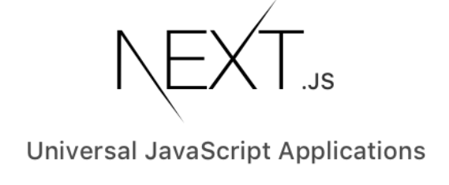

* Next.js  
  - ReactはSSR(Server Side Rendering)を便利に支援してくれるNext.jsというフレームワークを使いました。
  - SPAは基本的にCSR(Client Side Rendering)を使います。
  - CSRを使っているサイトは二つの短所を持っています。
  - まず、SEO(Search Engine Optimization)に弱いです。
  - グーグルの以外の検索エンジンはJavascriptをエクセキュートしないですからCSRを使っているサイトは内容がないサイトと同じに扱われになります。
  - 例えば、下の写真を見るとCSRを使っているngx-restangularというサイトとSSRを使っているこのプロジェクトのサイトの違うことを気付くことができます。
  
Ngx-restangular 

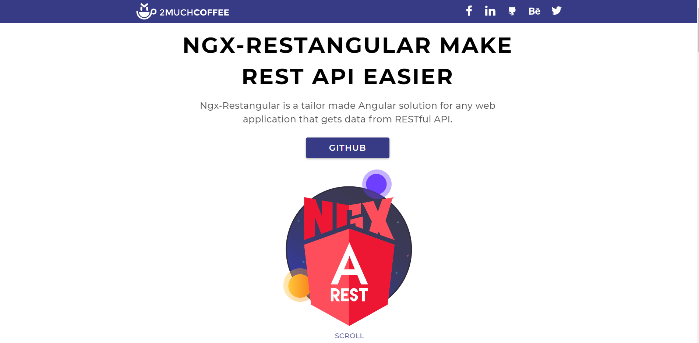
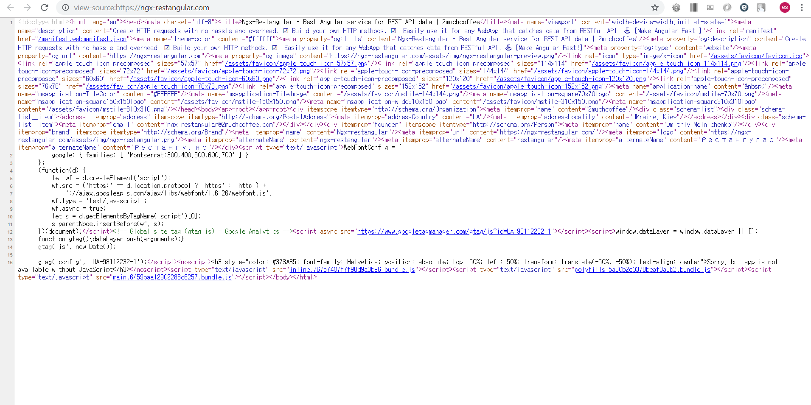
  - htmlは内容がないです。全てJavascriptでなっています。

---

Vetsuvetsu

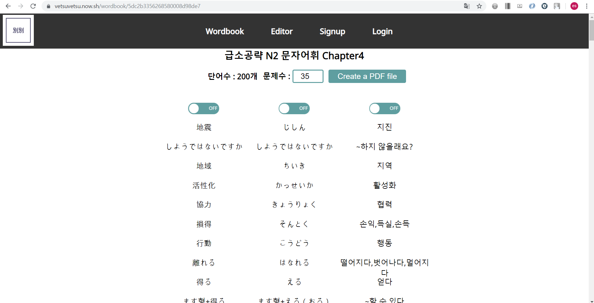
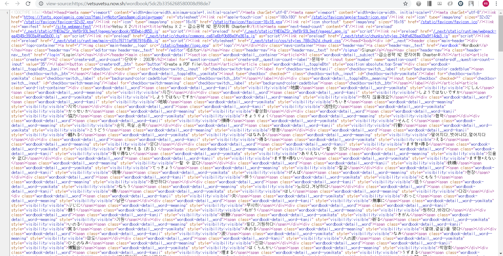
  - サーバからhtmlをもらって内容をしっかり見せています。

# P.S

私の不便を解消するために始めたプロジェクトでしたが、一緒に塾で日本語を勉強している学生たちからいい反応を得ました。

他の学生たちも授業時間に急いで書き取った単語を後で見る時見それていたので、整理になったリストで見ることができて以前より勉強するのが便利になっているという反応が多かったです。

そうして、会話の授業の単語テストを問題を自動で作ってくれる機能を使って受け始めました。

先生からわざわざこのように作ってくれるとはありがとうという言葉を聞きました。

まだいろいろな面で機能が足りないですが、ありがたがっている人の反応をみて開発者になるために努力していて良かったと思いをしました。

そうして、このプロジェクトを通じて開発者が及ぶことができる影響力について考え直してみる契機になりました。

自分の不便だけではなく世界を多少なりとももっといいところに作ることができる職業ということを知らされる契機になる点がこのプロジェクトの最も多くの収穫でしたと思っています。