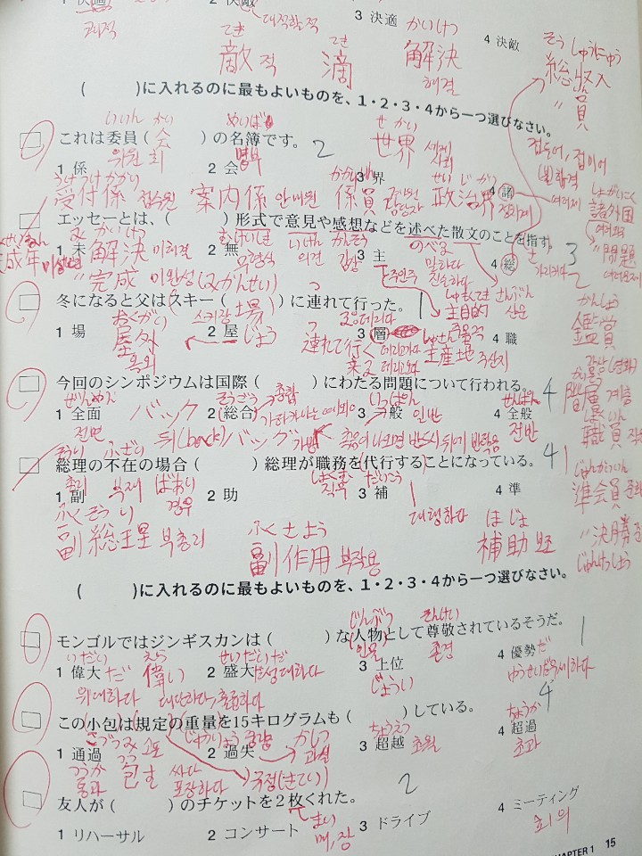

# Vetsuvetsu(別別)
> Make your own wordbook(자신만의 단어장을 만드세요, 自分の単語帳を作りましょう)

Project homepage　:　https://vetsuvetsu.now.sh/

관심있는 주제 혹은 공부중인 책의 단어들을 한 데 묶어 편리하게 공부하세요

(関心がある主題あるいわ勉強している本の単語を集まって便利に勉強しましょう) 

## 프로젝트를 시작한 이유(プロジェクトを始めた理由)

일본 취업을 위해 8월부터 어학원을 다니며 일본어 공부를 시작했습니다

(日本で働くために８月から塾で日本語の勉強を始めました。)

외국어를 잘하기 위해서는 무엇보다도 기초적인 어휘량을 늘리는 것이 중요하다고 생각합니다

(外国語が上手になるためにはなによりも基礎的な単語の量を増やすことが重要だと思います。)

이를 위해 학원에서 가르쳐주는 어휘들을 열심히 공부하려고 노력했습니다

(そのために塾で教えてくれた単語を熱心に勉強すると努力しました)

그런데 학원에서 배운 어휘들을 바쁘게 받아적다 보면 수업이 끝나고 나서 알아보기 힘들어지는 경우가 많았습니다

(しかし、塾で習った単語を熱心に書き取ってみたら授業が終わった後で見にくい場合が多かったです。)

예를 들어, 아래의 사진과 같은 경우들이 많았습니다
(例えば、下の写真のような場合が多かったです。)




```shell
packagemanager install awesome-project
awesome-project start
awesome-project "Do something!"  # prints "Nah."
```

```shell
git clone https://github.com/your/awesome-project.git
cd awesome-project/
packagemanager install
```

```shell
./configure
make
make install
```

```shell
packagemanager deploy awesome-project -s server.com -u username -p password
```

## Features

What's all the bells and whistles this project can perform?
* What's the main functionality
* You can also do another thing
* If you get really randy, you can even do this

## Configuration

Here you should write what are all of the configurations a user can enter when
using the project.

## Links

Even though this information can be found inside the project on machine-readable
format like in a .json file, it's good to include a summary of most useful
links to humans using your project. You can include links like:

- Project homepage: https://your.github.com/awesome-project/
- Repository: https://github.com/your/awesome-project/
- Issue tracker: https://github.com/your/awesome-project/issues
  - In case of sensitive bugs like security vulnerabilities, please contact
    my@email.com directly instead of using issue tracker. We value your effort
    to improve the security and privacy of this project!
- Related projects:
  - Your other project: https://github.com/your/other-project/
  - Someone else's project: https://github.com/someones/awesome-project/