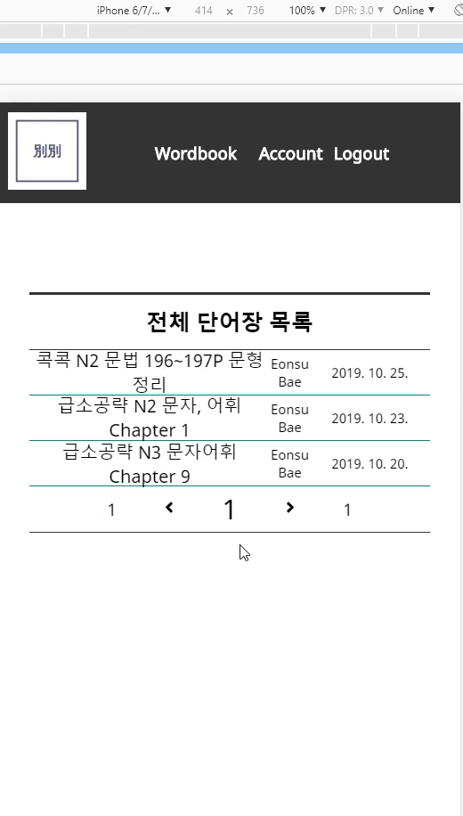

# Vetsuvetsu(別別)
> Make your own wordbook(자신만의 단어장을 만드세요, 自分の単語帳を作りましょう)

Project homepage　:　https://vetsuvetsu.now.sh/

## 機能１

マウスを使わなくてもEditorに単語を便利に入力することができます。

韓国語や英語と違ってTabキー、スペース・バー、エンターキーが単語の入力に使われている日本語の特性によってキャップス・ロック・キーをトリガーで使いました。

この機能は以前によくつかったVimというEditorで霊感を受けました。

プログラマーではない一般的な使用者たちもマウスがなく使えるEditorがあったらいいじゃないかという意図でこんな方式で作るようになりました。

## 機能２

### Desktop

### Mobile

トグルボタンを押して漢字と読み方と意味を見えるようにあるいわ見えないように作ることができます。

この機能はノートに書いて纏めて勉強していた時、ほかの紙や本で漢字以外のものを見えないように勉強したのが能率が良かったおかげで作くるようになりました。

## 機能３

入力になった単語帳の中でランダムでテストを作ってPDFファイルでダウンロードをもらうことができます。

毎朝、塾でテストを受けていることのような形式で問題を自動的に作るようにしたかったので作りました。

## Skill Set（スキルセット）

プロジェクトに使われているスキルセットのリスト
* Typescript(Javascript superset)
* MERN Stack(MongoDB, Express, React, Node.js)
* Sass(CSS Preprocessor)
* Deployment : ZEIT NOW, MongoDB Atlas

---
