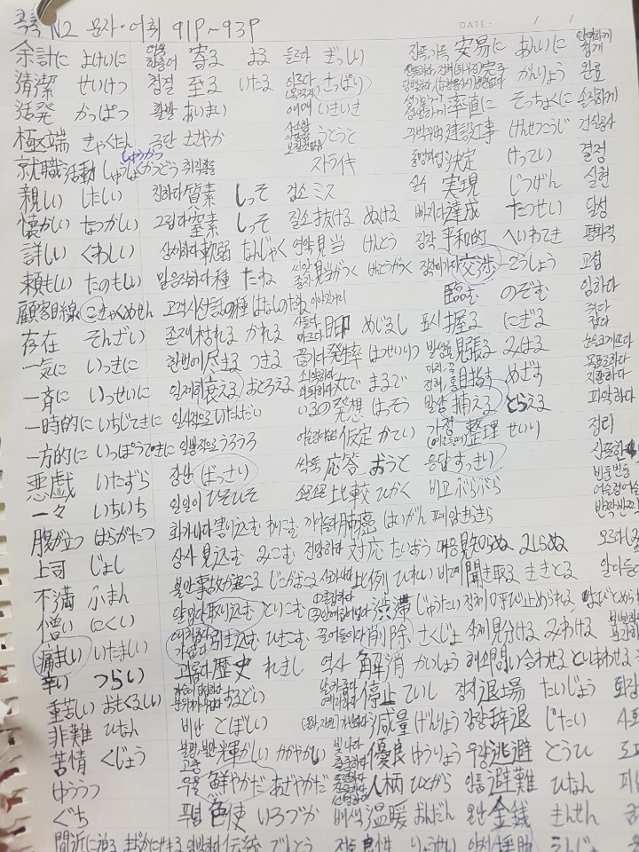
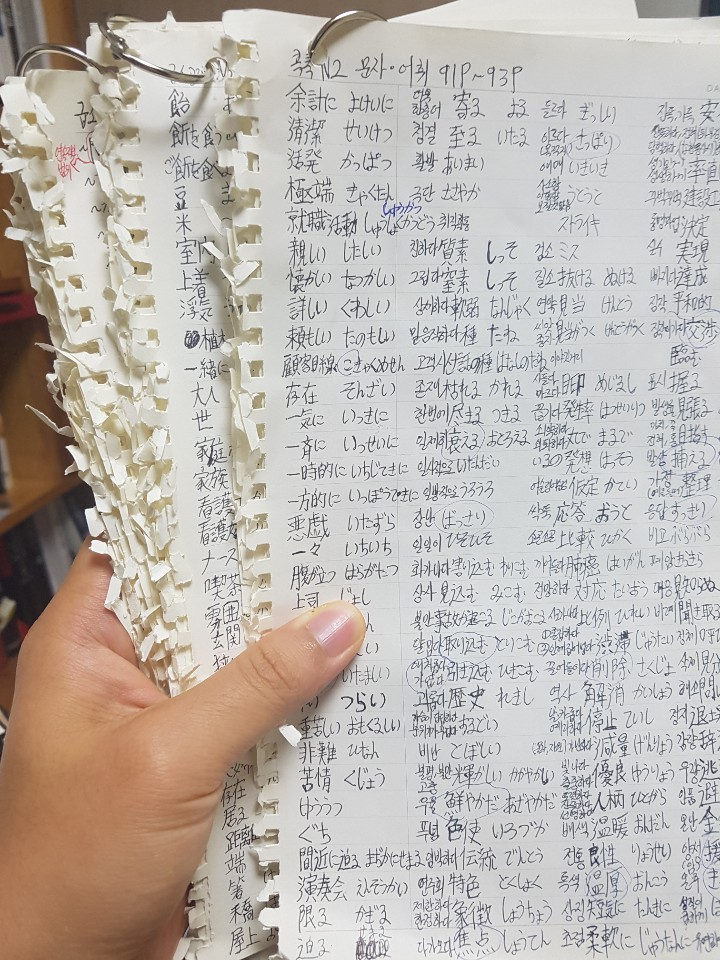

# Vetsuvetsu(別別)
> Make your own wordbook(자신만의 단어장을 만드세요, 自分の単語帳を作りましょう)

Project homepage　:　https://vetsuvetsu.now.sh/

관심있는 주제 혹은 공부중인 책의 단어들을 한 데 묶어 편리하게 공부하세요

(関心がある主題あるいわ勉強している本の単語を集まって便利に勉強しましょう) 

## 프로젝트를 시작한 이유(プロジェクトを始めた理由)

일본 취업을 위해 8월부터 어학원을 다니며 일본어 공부를 시작했습니다

(日本で働くために８月から塾で日本語の勉強を始めました。)

외국어를 잘하기 위해서는 무엇보다도 기초적인 어휘량을 늘리는 것이 중요하다고 생각합니다

(外国語が上手になるためには何よりも基礎的な単語の量を増やすことが重要だと思います。)

이를 위해 학원에서 가르쳐주는 어휘들을 열심히 공부하려고 노력했습니다

(そのために塾で教えてくれた単語を熱心に勉強すると努力しました)

그런데 학원에서 배운 어휘들을 바쁘게 받아적다 보면 수업이 끝나고 나서 알아보기 힘들어지는 경우가 많았습니다

(しかし、塾で習った単語を熱心に書き取ってみたら授業が終わった後で見にくい場合が多かったです。)

예를 들어, 아래의 사진과 같은 경우들이 많았습니다

(例えば、下の写真のような場合が多かったです。)


그래서 공부한 단어들을 편리하게 보기 위해서는 매번 다른 공책에 단어들을 옮겨적는 작업을 반복해야 했습니다

(そうして、勉強した単語を便利に見るためには毎度他のノートに単語を書き直す作業を繰り返しなければならなかったです。)

예를 들어, 아래의 사진과 같이 단어들을 한자, 요미카타, 한글의미 순으로 정렬해가며 정리했었습니다

(例えば、下の写真のように単語を漢字と読み方と韓国語の意味の順に並べ替えながら纏めました。)



그런데 이렇게 정리한 단어노트가 점점 늘어나자 다른 문제가 발생했습니다

(しかし、こんなに纏めた単語ノートがますます増えるのはほかの問題を発生させました。)

정리한 노트의 양이 지나치게 늘어나서 책의 두께 이상이 되자 휴대성이 급감한 것이었습니다

(纏めた単語ノートの量が増えすぎて本の厚さ以上になって携帯性が急減になりました。)




그래서 휴대성있게 단어를 공부할 수 있으면서, 동시에 시험까지 만들어주는 프로젝트를 해보면 어떨까 생각하게 되었습니다

(そして、携帯性がいい方法で勉強もできるし、同時に試験まで作ってくれるプロジェクトをして見るとどうかなと考えるようになりました。)

## 주요 기능 1 (重要な機能１)


마우스를 사용하지 않고도 에디터에 단어를 편하게 입력할 수 있습니다

(マウスを使わなくてもEditorに単語を便利に入力することができます。)

한국어나 영어와 달리 Tab, Space bar, Enter가 단어 입력에 쓰이는 일본어의 특성 때문에 Caps Lock키를 트리거로 사용했습니다

(韓国語や英語と違ってTabキー、スペース・バー、エンターキーが単語の入力に使われている日本語の特性によってキャップス・ロック・キーをトリガーで使いました。)

이 기능은 과거에 자주 사용했던 Vim이라는 에디터에서 영감을 받았습니다

(この機能は以前によくつかったVimというEditorで霊感を受けました。)

개발자가 아닌 일반 사용자들도 마우스 없이 사용 가능한 에디터가 있다면 좋지 않을까라는 의도에서 이런 방식으로 만들게 되었습니다

(プログラマーではない一般的な使用者たちもマウスがなく使えるEditorがあったらいいじゃないかという意図でこんな方式で作るようになりました。)

## 주요 기능 2 (重要な機能２)

### Desktop


### Mobile


토글 버튼을 눌러 한자, 요미카타, 의미를 보이거나 안보이도록 만들 수 있습니다

(トグルボタンを押して漢字と読み方と意味を見えるようにあるいわ見えないように作ることができます。)

이 기능은 노트에 써가며 정리해서 공부할 당시 다른 종이나 책으로 한자 이외의 것들을 가리며 공부했던 것이 능률이 좋았기 때문에 만들게 되었습니다
(この機能はノートに書いて纏めて勉強していた時、ほかの紙や本で漢字以外のものを見えないように勉強したのが能率が良かったおかげで作くるようになりました。)

## 주요 기능 3 (重要な機能３)


입력된 단어장 안에서 랜덤으로 테스트를 생성해 PDF파일로 다운로드 받을 수 있습니다

(入力になった単語帳の中でランダムでテストを作ってPDFファイルでダウンロードをもらうことができます。)

매일 아침 어학원에서 테스트를 보는 것과 같은 형식으로 문제를 자동으로 생성하게끔 하고 싶었기 때문에 만들었습니다

(毎朝、塾でテストを受けていることは同じ形式で問題を自動的に作るようにしたかったので作りました。)

## Skill Set（スキルセット）


```shell
packagemanager install awesome-project
awesome-project start
awesome-project "Do something!"  # prints "Nah."
```

```shell
git clone https://github.com/your/awesome-project.git
cd awesome-project/
packagemanager install
```

```shell
./configure
make
make install
```

```shell
packagemanager deploy awesome-project -s server.com -u username -p password
```

## Features

What's all the bells and whistles this project can perform?
* What's the main functionality
* You can also do another thing
* If you get really randy, you can even do this

## Configuration

Here you should write what are all of the configurations a user can enter when
using the project.

## Links

Even though this information can be found inside the project on machine-readable
format like in a .json file, it's good to include a summary of most useful
links to humans using your project. You can include links like:

- Project homepage: https://your.github.com/awesome-project/
- Repository: https://github.com/your/awesome-project/
- Issue tracker: https://github.com/your/awesome-project/issues
  - In case of sensitive bugs like security vulnerabilities, please contact
    my@email.com directly instead of using issue tracker. We value your effort
    to improve the security and privacy of this project!
- Related projects:
  - Your other project: https://github.com/your/other-project/
  - Someone else's project: https://github.com/someones/awesome-project/